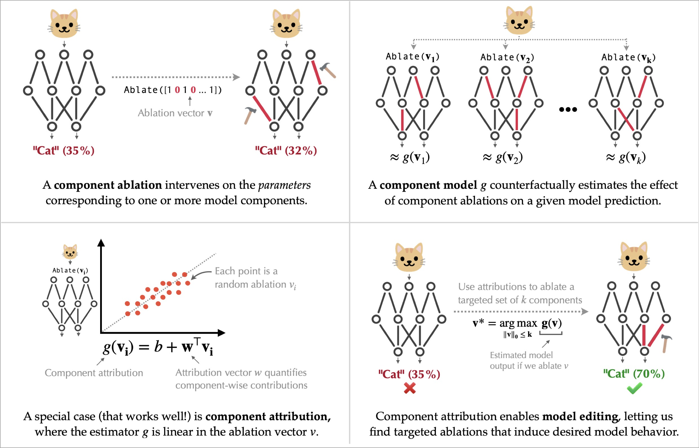
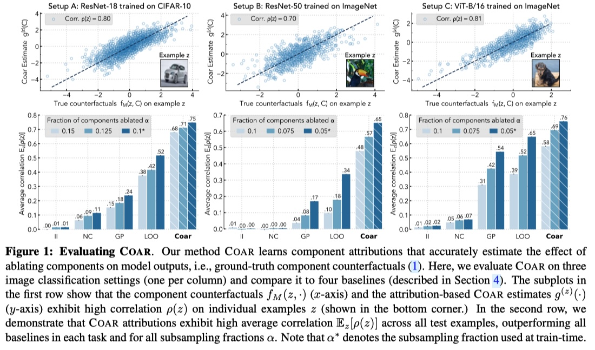
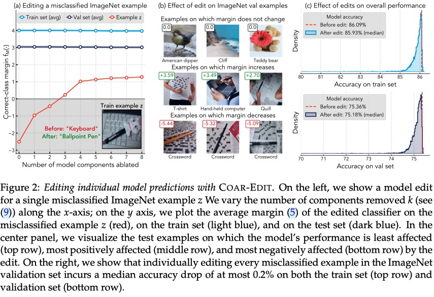
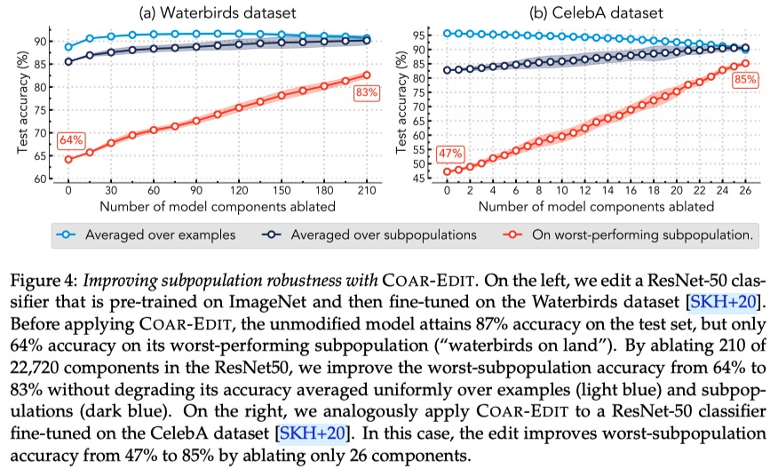
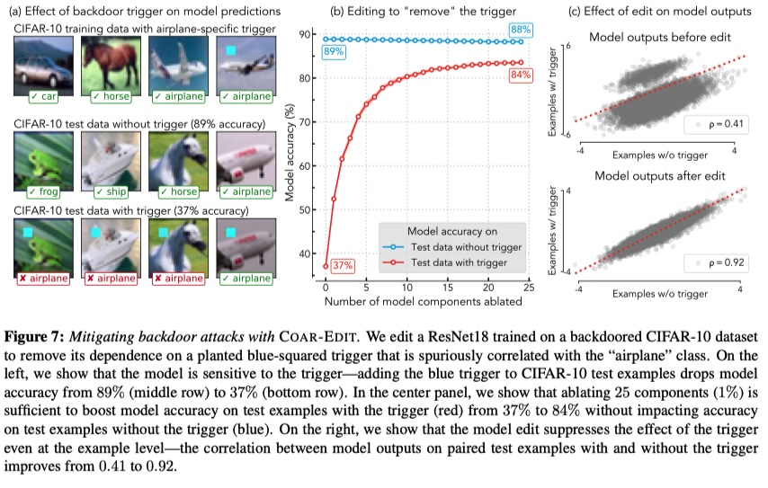

# Decomposing and Editing Predictions <br> by Modeling Model Computation

This repository contains the code to estimate and analyze *component attributions*, as introduced in our paper:

**Decomposing and Editing Predictions by Modeling Model Computation** <br>
*Harshay Shah, Andrew Ilyas, Aleksander Madry* <br>
Paper: [https://arxiv.org/abs/2404.11534](https://arxiv.org/abs/2404.11534) <br>
Blog post: [gradientscience.org/modelcomponents](https://gradientscience.org/modelcomponents)

<p align = 'center'>
  
</p>

<p align='center'>
[<a href="#overview">Overview</a>]
[<a href="#installation">Installation</a>]
[<a href="#estimating-component-attributions-with-coar">Code</a>]
[<a href="#pre-computed-component-attributions">Data</a>]
[<a href="#editing-models-with-coar-edit">Notebooks</a>]
[<a href="#citation">Citation</a>]
</p>

## Overview
<p align='center'>
<i>How does the internal computation of deep neural networks transform examples into predictions?</i>
</p>

In our [paper](https://arxiv.org/abs/2404.11534), we attempt to better characterize this computation by decomposing predictions in terms of *model components*, i.e., architectural "building blocks" such as convolution filters or attention heads that carry out a model's computation.
We formalize our high-level goal of understanding how model components shape a given prediction into a concrete task called *component modeling*, described below.

**Component models.**
The goal of a component model is to answer counterfactual questions like "what would happen to my image classifier on a given example if I ablated a specific set of convolution filters?" without intervening on the model computation.
Given an example, a component attribution---a *linear* component model---is a linear counterfactual estimator that (a) assigns a "score" to each model component and (b) estimates the counterfactual effect of ablating a set of components on the example's prediction as a sum over component-wise scores.

**Estimating component attributions with Coar**.
We develop a scalable method for estimating component attributions called Coar.
In [Section 4 of our paper](https://arxiv.org/abs/2404.11534), we show that Coar yields accurate component attributions on large-scale vision and language models such as ImageNet ViTs and Phi-2.
In this repository, we provide [pre-computed component attributions](#pre-computed-component-attributions) as well as [code for evaluating and applying Coar *from scratch*](#estimating-component-attributions-with-coar).

**Editing models with component attributions.**
We also develop Coar-Edit, a simple three-step procedure for model editing using Coar attributions.
[Section 5 of our paper](https://arxiv.org/abs/2404.11534) applies Coar-Edit to editing tasks such as fixing model errors, improving subpopulation robustness, and improving robustness to backdoor attacks.
Here, we provide [notebooks](#editing-models-with-coar-edit) to reproduce (and extend) these experiments.

## Installation

Our code relies on the [FFCV Library](https://ffcv.io/). To install this library along with other dependencies including PyTorch, follow the instructions below:

```bash copy
conda create <ENVNAME> python=3.9 cupy pkg-config libjpeg-turbo opencv pytorch torchvision cudatoolkit=11.6 numba tqdm matplotlib seaborn jupyterlab ipywidgets cudatoolkit-dev scikit-learn scikit-image -c conda-forge -c pytorch
conda activate <ENVNAME>
conda update ffmpeg

git clone git@github.com:madrylab/model_components.git
cd model_components
pip install -r requirements.txt
```

## Estimating component attributions with *Coar*
<p align = 'center'>
  
</p>

**Estimating Coar attributions.**
As shown above, we evaluate Coar, our method for estimating component attributions, on deep neural networks trained on image classification tasks.
We provide code in `coar/` to compute Coar attributions *from scratch* for all three setups:

| 🧪 Experiment Setup | 🧩 Code for estimating Coar attributions |
|---------------------|--------------|
| ResNet18 trained on CIFAR-10  <br> (Setup A in Section 4) |  [`coar/estimate/cifar_resnet/`](https://github.com/MadryLab/modelcomponents/tree/main/coar/estimate/cifar_resnet) |
| ViT-B/16 trained on ImageNet  <br> (Setup B in Section 4) |  [`coar/estimate/imagenet_resnet/`](https://github.com/MadryLab/modelcomponents/tree/main/coar/estimate/imagenet_resnet) |
| ResNet50 trained on ImageNet  <br> (Setup C in Section 4) |  [`coar/estimate/imagenet_vit/`](https://github.com/MadryLab/modelcomponents/tree/main/coar/estimate/imagenet_vit) |
| GPT-2 evaluated on TinyStories  <br> (Appendix I.1) |  [`coar/estimate/gpt2_tinystories/`](https://github.com/MadryLab/modelcomponents/tree/main/coar/estimate/gpt2_tinystories) |

For each setup, we compute Coar attributions (one per test example) in three stages:
1. **Initialization**: We first use a user-defined JSON specification file to initialize a directory of data stores, i.e., memory-mapped numpy arrays.
2. **Dataset construction**: We then the data stores from above in order to incrementally build a "component dataset" for every example. Specifically, we use a Python script to construct component datasets containing tuples of (a) $\alpha$-sized random subsets of model components $C'$ and (b) the outputs of the model after ablating components in subset $C'$.
3. **Regression**: We use the datasets described above to estimate component attributions (one per example) using [fast_l1](https://github.com/MadryLab/fast_l1), a SAGA-based GPU solver for linear regression.

For a more detailed description of each stage, check our our mini-tutorial [here](https://github.com/MadryLab/modelcomponents/tree/main/coar).


**Evaluating Coar attributions**:
We provide code for evaluating Coar attributions in `coar/evaluate`.
Specifically, our evaluation quantifes the extent to which Coar attributions
can accurately predict the counterfactual effect of ablating random $\alpha$-sized
component subsets  on model outputs.
In this repo, we evaluate pre-computed attributions of a CIFAR-10 ResNet model ([notebook](https://github.com/MadryLab/modelcomponents/blob/main/coar/evaluate/example_cifar.ipynb)) and an ImageNet ViT-B/16 model ([notebook](https://github.com/MadryLab/modelcomponents/blob/main/coar/evaluate/example_imagenet.ipynb)).

🚧 **Coming soon** 🚧:
A `pip`-installable package for estimating and evaluating Coar attributions on any model, dataset, and task
in a streamlined manner.

## Pre-computed component attributions

We also open-source a set of Coar-estimated component attributions that we use in our [paper](https://arxiv.org/abs/2404.11534):

| 💾  Dataset | 🔗 Model | 🧮 Component attributions using Coar |
|---------------------|----------|----------------------|
| CIFAR-10 <br> [[url](https://www.cs.toronto.edu/~kriz/cifar.html)]   | ResNet model trained from scratch <br> [[module](https://github.com/MadryLab/modelcomponents/blob/main/coar/src/models/mini_resnet.py)] [[.pt](https://www.dropbox.com/scl/fi/ar7fput9rzyxebep0cgqf/cifar.pt?rlkey=y4hmrj94o4vxe4so55z1ebefw&e=1&dl=0)] | Components: 2,304 conv filters <br> Attributions: [[test.pt](https://www.dropbox.com/scl/fi/muszxvauowakwvlczjgct/cifar.pt?rlkey=t1kqjusw1p3yr6264cxnnx1f5&dl=0)]  |
| ImageNet <br> [[url](https://www.image-net.org/download.php)]   | `torchvision.models.ResNet50_Weights.IMAGENET1K_V1`<br>[[url](https://pytorch.org/vision/main/models/generated/torchvision.models.resnet50.html#torchvision.models.ResNet50_Weights)] | Components: 22,720 conv filters <br> Attributions: [[val.pt](https://www.dropbox.com/scl/fi/vd38pyjjyz1g7zu72r741/imagenet_resnet.pt?rlkey=45ideswhv9x3tyu7ctjcd84df&dl=0)] |
| ImageNet <br> [[url](https://www.image-net.org/download.php)]   | `torchvision.models.ViT_B_16_Weights.IMAGENET1K_V1`<br>[[url](https://pytorch.org/vision/main/models/generated/torchvision.models.vit_b_16.html)] | Components: 82,944 neurons <br> Attributions: [[val.pt](https://www.dropbox.com/scl/fi/lm4hnvz4la8g9cg7ex9gp/imagenet_vit.pt?rlkey=6jz2rrrug1rw0zfdddeetooxo&dl=0)]  |
| CelebA <br> [[url](http://mmlab.ie.cuhk.edu.hk/projects/CelebA.html)]           | Fine-tuned ImageNet ResNet50 `torchvision` model<br>[[.pt](https://www.dropbox.com/scl/fi/7z6wqt6bv4hsxmefsbm0i/celeba.pt?rlkey=5jmee0tybtsuffig3ltd76ri7&dl=0)] | Components: 22,720 conv filters <br> Attributions: [[train.pt](https://www.dropbox.com/s/bfv9xehe6yn6npy/celeba_train.pt?dl=0)] [[test.pt](https://www.dropbox.com/s/bfv9xehe6yn6npy/celeba_test.pt?dl=0)] |
| Waterbirds <br> [[url](https://github.com/p-lambda/wilds/)]   | Fine-tuned ImageNet ResNet50 `torchvision` model<br>[[.pt](https://www.dropbox.com/scl/fi/1s3tkijob7xqyytv9go9k/waterbirds.pt?rlkey=tjor5safav9f1u73yktcdz4u5&dl=0)] | Components: 22,720 conv filters <br> Attributions: [[train.pt](https://www.dropbox.com/scl/fi/dqt5kewb282all574wgae/waterbirds_train.pt?rlkey=83rw1g5afyj3adh48d5mnsnpi&dl=0)] [[test.pt](https://www.dropbox.com/scl/fi/3h2e91xjdzzdpxtjnotqs/waterbirds_test.pt?rlkey=sntv3xybu46764xpxrq3jzar0&dl=0)] |

Alternatively, to download all models and component attributions in one go, run:
```bash copy
REPO_DIR=/path/to/local/repo
mkdir -p "$REPO_DIR/data"
wget 'https://www.dropbox.com/scl/fo/8ylssq64bbutqb8jzzs7p/h?rlkey=9ekfyo9xzxclvga4hw5iedqx0&dl=1' -O "$REPO_DIR/data/data.zip"
unzip -o "$REPO_DIR/data/data.zip" -d "$REPO_DIR/data" 2>/dev/null
rm -f "$REPO_DIR/data/data.zip"
```

## Editing models with *Coar-Edit*

In our [paper](https://arxiv.org/abs/2404.11534), we show that Coar-estimated attributions directly enable model editing.
Specifically, we outline a simple three-step procedure for model editing called Coar-Edit and demonstrate its effectiveness on six editing tasks ranging from fixing model errors
to mitigating backdoor attacks.

In this repository, we provide Jupyter notebooks in `coar_edit` to reproduce our model editing experiments
using pre-computed component attributions from  [above](#pre-computed-component-attributions).
Specifically, we provide notebooks for the following experiments:

| 🧪 Experiment | 📓 Jupyter Notebook | 📊 Plot |
|---------------|---------------------|---------|
| Fixing a model error <br> ([Section 5.1](https://arxiv.org/abs/2404.11534)) | [`coar/edit/model_errors.ipynb`](https://github.com/MadryLab/modelcomponents/blob/main/coar/edit/model_errors.ipynb) |  |
| Improving subpopulation robustness <br> ([Section 5.3](https://arxiv.org/abs/2404.11534)) | [`coar/edit/subpop_robustness.ipynb`](https://github.com/MadryLab/modelcomponents/blob/main/coar/edit/subpop_robustness.ipynb) |  |
| Mitigating backdoor attacks <br> ([Section 5.4](https://arxiv.org/abs/2404.11534)) | [`coar/edit/backdoor_attack.ipynb`](https://github.com/MadryLab/modelcomponents/blob/main/coar/edit/backdoor_attack.ipynb) |  |


🚧 **Coming soon** 🚧: Notebooks for reproducing two more experiments from our paper: Selectively forgetting classes (Section 5.2); Improving CLIP robustness to typographic attacks (Section 5.5).


### Citation
If you use this code in your work, please cite using the following BibTeX entry:
```bibtex
@inproceedings{shah2024decomposing,
  title={Decomposing and Editing Predictions by Modeling Model Computation},
  author={Harshay Shah and Andrew Ilyas and Aleksander Madry},
  booktitle={Arxiv preprint arXiv:2404.11534},
  year={2024}
}
```

## Maintainers
[Harshay Shah](https://twitter.com/harshays_)
